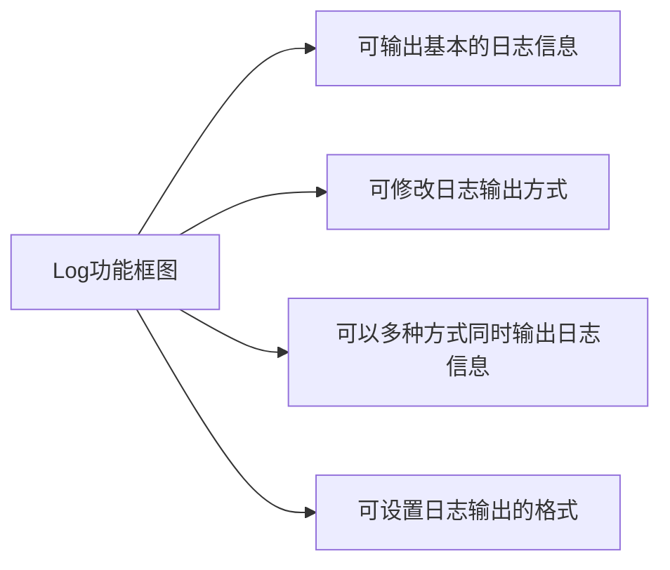
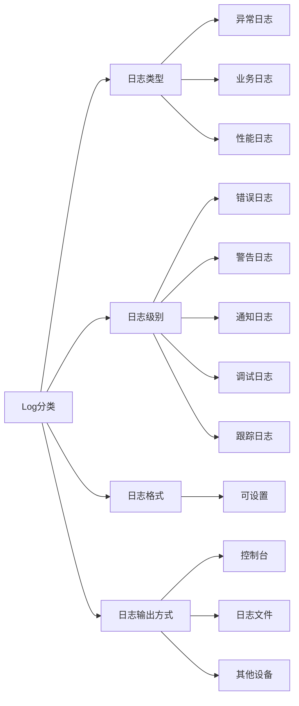

日志系统
===

2020年6月25日

## 已完成功能

#### 2020年7月4日

- 实现了日志的输出，默认输出到日志文件，可自定义输出方式
- 实现了日志的格式化，支持UNNKOWN、INFO、ERROR、WANRNING、DEBUG、TRAC格式，支持修改格式
- 重定向了<<，默认<<输出一次便格式化一次，<<支持字符（串）、数字
- 使用了双缓冲，缓冲区大小为4Kb，当前端缓冲区满时，将缓冲区交换并保存，若3s内未满，也没有更新缓冲区的信号也将自动更新，确保日志的及时性
- 使用了多线程，实现前后端，数据写入与输出分离
- 增加了原子操作和锁
- LOG的构造函数为（日志级别，日志名，自定义输出方式），所有参数均支持默认参数
- 重载了printf函数，此方式默认没有格式化
- 增加线程安全，增加了输出实例的修改接口
- 增加格式化实例函数，并增加了修改接口

